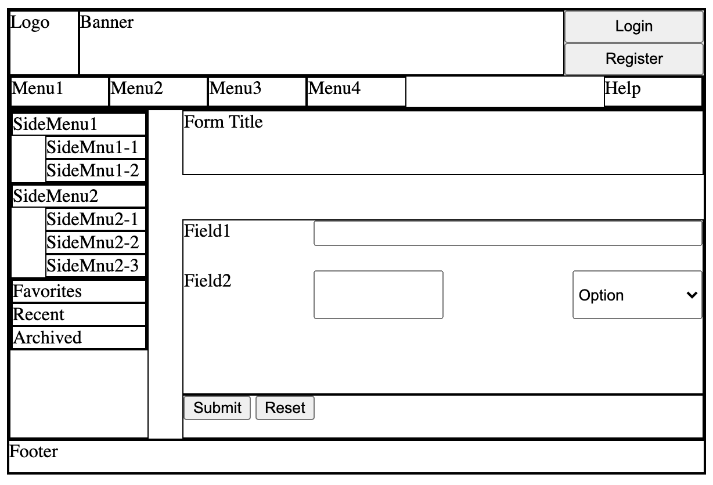
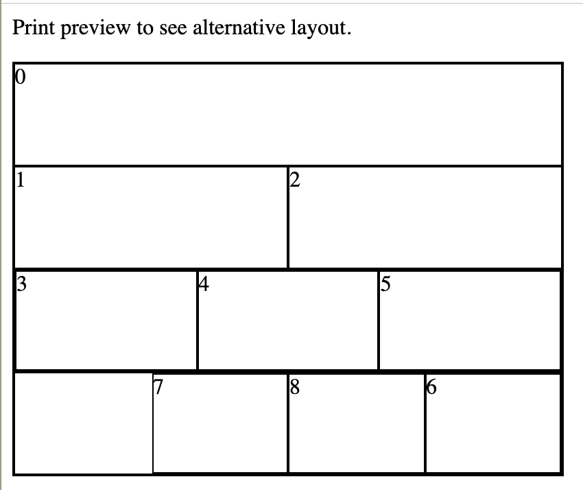
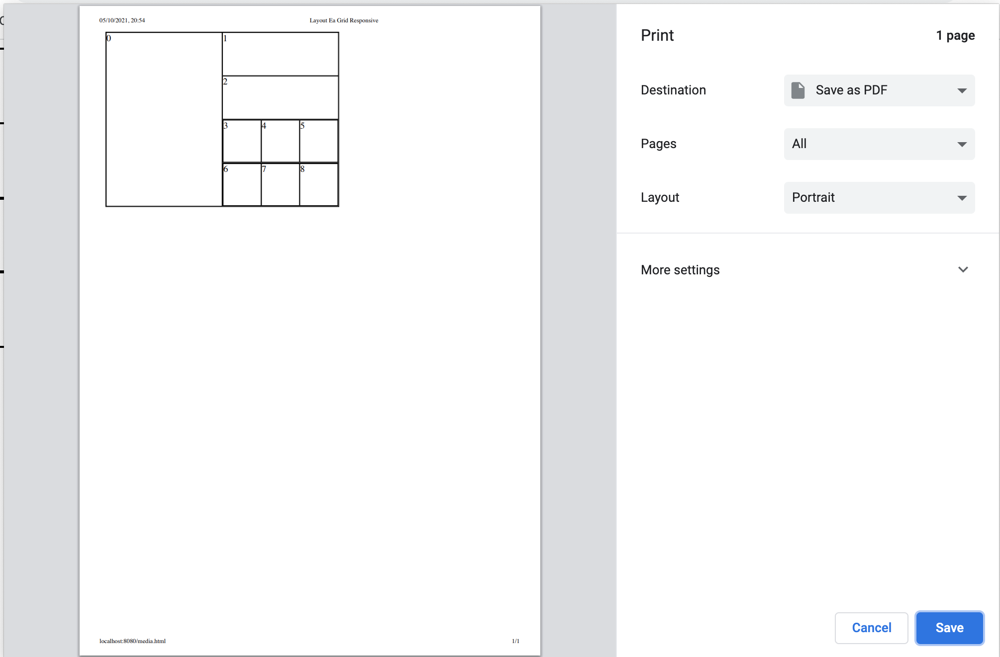

# Layout Ea Grid
This layout manager lays out the immediate child HTML elements of the given HTML element in a CSS grid of equally sized cells.
The number of columns and rows is configurable.
The parent HTML element of each grid is given a class of **layout-ea-grid** which can be used as a CSS selector to further customize styles.

***
# Getting Started
## Installation
```bash
npm install --save @fmm/layout-ea
```

## Usage

LayoutEaGrid implements the [LayoutEaStrategy](Readme.md#layouteastrategy) interface required by the [LayoutEa](Readme.md#layoutea) API.
Please note that [LayoutEaGrid](README_Grid.md) is a **const** object, not a class.

```ts
import { LayoutEa, LayoutEaGrid } from 'layout-ea';
LayoutEa.layout(document.body, {
    layout: {
        // layout
    },
    strategy: LayoutEaGrid
});
```

## Example

Feel free to copy the file below and play around with the layouts to see the results.



```html
<html>

<head>
    <meta charset="UTF-8" />
    <title>Layout Ea Grid Demo</title>
    <style>
        /* this would normally be in a separate file */
        div {
            border: 1px solid black;
        }

        .root {
            width: 600px;
            height: 400px;
        }
    </style>
    <script src='//cdn.jsdelivr.net/gh/sparrowhawk-ea/layout-ea/dist/index.js'></script>
    <script>
        // this would normally be in a separate file
        function doLayout() {
            LayoutEa.LayoutEa.layout(document.body, {
                debug: true,
                layout: {
                    '.hdr': '0,,2 1,BannerWidth,2 BUTTON,2; BUTTON/1,2; #menu,*',
                    '.root': '+3 0; +10 #main; 1',
                    '#accordion': '*!,100 0',
                    '#form1': '0 1,3;; +2 [2-3,_,.combobox]; +3',
                    '#main': '+3 0,4,FullHeight _,,FullHeight 1,15; +2; +8 #form1,*; +2 2,*',
                    '#menu': 'DIV/* [_,_,DIV/0]',
                    '#smenu1': '0,4; _,,FullHeight 1,*; *! 2,*',
                    '#smenu2': '@#smenu1'
                },
                sizes: {
                    'BannerWidth': '7',
                    'FullHeight': '*!'
                },
                strategy: LayoutEa.LayoutEaGrid
            });
        }
    </script>
</head>

<body onload='doLayout()'>
    <div class='root'>
        <div class='hdr'>
            <div>Logo</div>
            <div>Banner</div>
            <button>Login</button>
            <button>Register</button>
            <div id='menu'>
                <div>Help</div>
                <div>Menu1 </div>
                <div>Menu2 </div>
                <div>Menu3 </div>
                <div>Menu4</div>
            </div>
        </div>
        <div>Footer</div>
        <div id='main'>
            <div>
                <div id='smenu1'>
                    <div>SideMenu1</div>
                    <div>SideMnu1-1</div>
                    <div>SideMnu1-2</div>
                </div>
                <div id='smenu2'>
                    <div>SideMenu2</div>
                    <div>SideMnu2-1</div>
                    <div>SideMnu2-2</div>
                    <div>SideMnu2-3</div>
                </div>
                <div id='accordion'>
                    <div>Favorites</div>
                    <div data-ea-index='100'>Recent</div>
                    <div data-ea-index='200'>Archived</div>
                </div>
            </div>
            <div>Form Title</div>
            <div>
                <button>Submit </button>
                <button>Reset</button>
            </div>
            <div id='form1'>
                <span>Field1</span>
                <input />
                <span>Field2</span>
                <input />
                <select class='combobox'>
                    <option>Option</option>
                </select>
            </div>
        </div>
    </div>
</body>

</html>
```

## Media Example




```html
<html>

<head>
    <meta charset="UTF-8" />
    <title>Layout Ea Grid Responsive</title>
    <style>
        /* this would normally be in a separate file */
        div {
            border: 1px solid black;
        }

        #root {
            width: 400px;
            height: 300px;
        }
    </style>
    <script src='//cdn.jsdelivr.net/gh/sparrowhawk-ea/layout-ea/dist/index.js'></script>
    <script>
        // this would normally be in a separate file
        function doLayout() {
            LayoutEa.LayoutEa.layout(document.body, {
                debug: true,
                mediaLayouts: [{
                    mediaQuery: 'screen',
                    layout: {
                        '#root': '0,2; 1 2; *! 3,*',
                        '#unchanged': 'DIV/*',
                        '#second': '_ DIV/* 0'
                    }
                }, {
                    name: 'print',
                    mediaQuery: 'print',
                    fallback: 'screen',
                    layout: {
                        '#root': '0,,*! 1; *! 2',
                        // '#unchanged' layout will be copied from the fallback media 'screen'
                        '#second': '@screen:#unchanged'
                    }
                }],
                strategy: LayoutEa.LayoutEaGrid
            });
        }
    </script>
</head>

<body onload='doLayout()'>
    <div id='root'>
        <div>0</div>
        <div>1</div>
        <div>2</div>
        <div id='unchanged'>
            <div>3</div>
            <div>4</div>
            <div>5</div>
        </div>
        <div id='second'>
            <div>6</div>
            <div>7</div>
            <div>8</div>
        </div>
    </div>
</body>

</html>
```

***
# Layout Specification

A layout specification consists of a **Record<string, string>** which maps CSS selectors to layout specification strings.
An HTML element matching a CSS selector is laid out according to the corresponding grid specification which consists of a list of row specifications separated by a semicolon ';'.

A row specification consists of a list of item specifications separated by white space.
A row specification may optionally be prefixed by a plus '+' sign and the row height in number of grid cells.
The default is one grid row per specification row.

A row specification may also optionally be prefixed by a times '*' sign and a repeat count or consume '!' marker to repeat until all referenced children are consumed.
A row repeat specification may optionally include a list of index increments to apply on each iteration when a child ordinal or CSS selector index is used within the row specification.
These index increments can be used in conjunction with the data-ea-index attribute on an HTML element as described in the [API](README.md#api).

An item specification consists of one to three parts separated by a comma ','.
The first part is a list of child references, each of which can be a child ordinal index, a hyphen-separated range of indices, a qualified CSS selector, or '_' to indicate blank space.
A qualified CSS selector is a simple CSS selector like an HTML id attribute, HTML class attribute, or HTML tag name, optionally followed by a slash and a wildcard '*' or ordinal index to choose from the list of matching children.
A CSS selector must not contain any of the special characters used in the specification grammar.
A child may match multiple child references but explicit references (with an HTML ID, a child ordinal index, or a non-wildcard selector) will take precedence and the other matches will be silently ignored.
It is an error to specify multiple explicit references for a child.

The second part is the item's width in number of columns or wildcard '\*'.
A wildcard width means the item should extend until the grid's right edge or until blocked by a multi-row item extending from the previous row.
The width may be followed by an optional force-width '!' marker to indicate that the width may be satisfied by closing any multi-row items along the way which do not have an explicit height or a grid-bottom '!' marker.

The third part is the item's height in number of specification rows or wildcard '\*'.
A wildcard height means the item should extend downward until closed by a item in a lower row with a force-width '!' marker.
The height may be followed by an optional grid-bottom '!' marker to require that the item should extend to the bottom of the grid.

It is important to note that the item height is specified in terms of specification rows, not grid rows.
The latter may be more than the former when specification rows have an explicit row height of more than one.
For example, the layout specification '#header; +5 #body; #footer' has 3 specification rows and 7 grid rows.

The first row must not contain any cells with wildcard width.

In the grammar below, a grid layout specification string consists of **rows**.

Specification | Extended Backus-Naur Form | Example
--- | --- | ---
**consume** | '!'
**index increment** | [ **selector** , '/' ] , positive integer | DIV/10
**row** | [ **row repeat** ] , [ **row height** ] , **items** | *!,50,DIV/10 +3 0 DIV/0
**row height** | '+' , **size** | +3
**row repeat** | '*' , ( **consume** \| positive integer ) , { ',' , **index increment** } | *! , 50 , DIV/10
**rows** | **row** , { ';' , **row** }
&nbsp;
**force width** | '!'
**grid bottom** | '!'
**item** | **child refs** , [ **item width** [ **item height** ] ] | #sidemenu , MenuWidth , *!
**item height** | ',' , [ '*' \| **size** ] , [ **grid bottom** ] | *!
**item width** | ',' , [ '*' \| **size** ] , [ **force width** ] | MenuWidth
**items** | **item** , { ' ' , **item** }
&nbsp;
**child indices** | '*' \| ( non negative integer , [ '-' , non negative integer ] ) | 2-3
**child ref** | '_' \| **child indices** \| ( **selector** , [ '/' , **selector index** ] ) | .combobox/1
**child refs** | **child ref** \| ( '[' , **child ref** , { ',' , **child ref** } , ']' ) | [ 2-3 , _ , .combobox/1 ]
&nbsp;
**selector** | ( '#' , id ) \| ( '.' , class ) \| HTML tag | .combobox
**selector index** | '*' \| non negative integer | 1
&nbsp;
**size** | positive integer \| alias in LayoutEaConfig.sizes | MenuWidth
